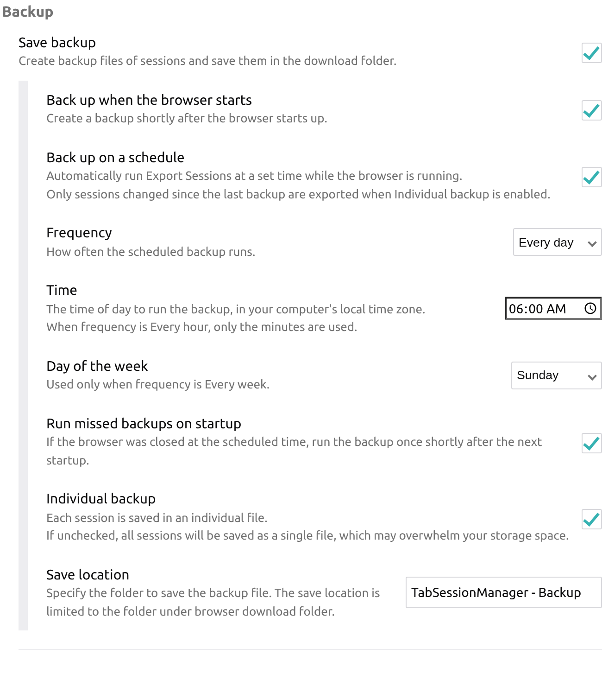
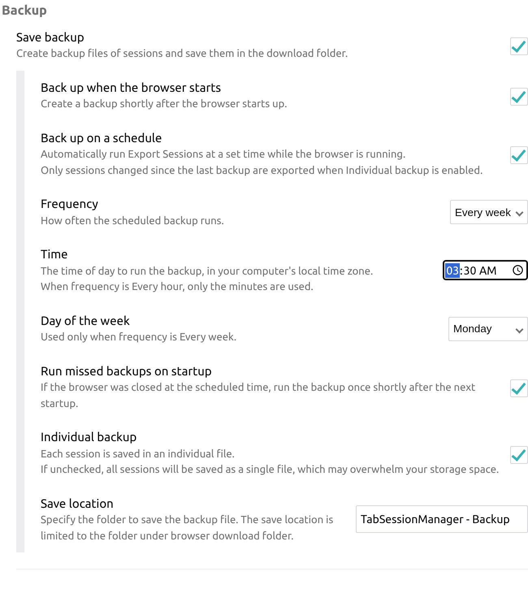
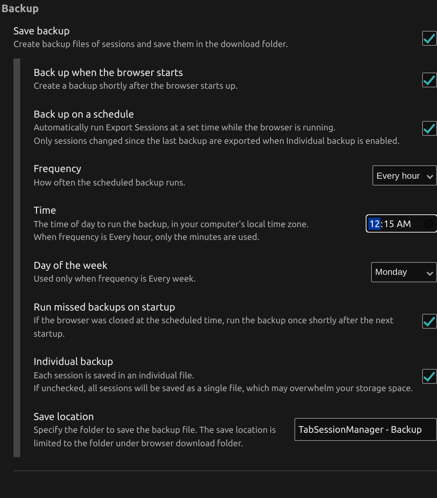
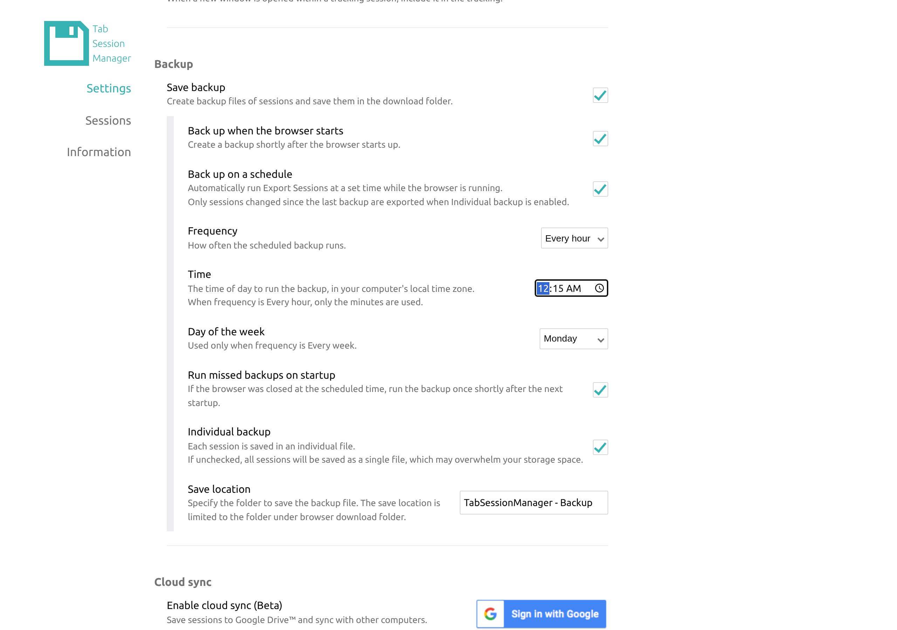
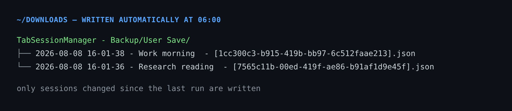

# <sub></sub> Better Tab Session Manager

A fork of [sienori/Tab-Session-Manager](https://github.com/sienori/Tab-Session-Manager) that
exports your sessions to disk on a schedule, so a corrupted profile or a full disk can't
take your tabs with it.

Upstream can only write a backup once, when the browser starts. If you leave your browser
running for days, that backup never happens. This fork adds a real scheduler.

> Upstream is excellent software, and this fork exists only to scratch one specific itch.
> The original README is preserved at [readme-original.md](readme-original.md).

## Why

The `ifBackup` setting upstream fires exactly one alarm, from `onStartup`:

```js
browser.alarms.create("backupSessions", { delayInMinutes: 0.5 });
```

That is the whole backup story. Related upstream reports:

| Issue | |
|---|---|
| [#1486](https://github.com/sienori/Tab-Session-Manager/issues/1486) | All data wiped after running out of disk space. *"The 'When browser starts up, create a backup' setting doesn't make any sense. Why not save intervally/incrementally"* |
| [#1130](https://github.com/sienori/Tab-Session-Manager/issues/1130) | Save to file automatically on an interval rather than only at startup |
| [#173](https://github.com/sienori/Tab-Session-Manager/issues/173) | Original 2018 request for scheduled export, resolved with startup-only backup |

## What this fork adds

A "Back up on a schedule" option, on by default, that runs the existing Export Sessions
routine at a time you pick.



The controls, in the order they appear:

* Frequency: every hour, day, or week.
* Time: wall-clock time in your own timezone. `06:00` means 06:00 where you are.
* Day of the week, for weekly schedules.
* Run missed backups on startup. If the browser was closed at 06:00, back up shortly after
  the next launch. Without this, "every day at 6am" silently never runs for anyone who
  isn't at their desk at 6am.
* Back up when the browser starts, which is upstream's original behaviour, now a toggle.

Weekly, every Monday at 03:30:



Hourly, dark theme:



In context on the options page:



### The output is incremental

With Individual backup enabled (the default), each run only writes sessions whose
`lastEditedTime` is newer than the last run. An unchanged session costs nothing.



Files land under your browser download folder, in the folder named by the Save location
setting. Paths, filenames, and `overwrite` behaviour match upstream's export. Nothing about
the on-disk format changed, so these files import back into stock Tab Session Manager.

## Defaults changed from upstream

Two of them, both because data loss is the entire point of the fork:

| Setting | Upstream | Here |
|---|---|---|
| `ifBackup` | `false` | `true` |
| `ifScheduledBackup` | (new) | `true`, daily at 06:00 |

A fresh install therefore starts backing up to `~/Downloads/TabSessionManager - Backup/`
without being asked. If you'd rather it didn't, flip `ifBackup` back to `false` in
[`src/settings/defaultSettings.js`](src/settings/defaultSettings.js). Existing installs are
unaffected either way, since `initSettings()` only fills in keys that are missing.

## Design notes

Scheduling uses one-shot alarms that re-arm after each run, rather than a repeating
`periodInMinutes: 1440`. A fixed 24-hour period drifts off the wall clock every time DST
shifts. Recomputing the next occurrence from a local `Date` keeps 06:00 at 06:00 year-round:

```
across spring-forward  ->  absolute elapsed: 20h, wall clock still 06:00
across fall-back       ->  absolute elapsed: 22h, wall clock still 06:00
```

No new permissions are needed. `alarms` and `downloads` were already in the manifest.

Everything reuses `backupSessions()`. The scheduler only triggers the existing export path,
so incremental logic, folder naming, chunking for large session sets, and blob cleanup all
behave as they do upstream.

New code lives in [`src/background/scheduledBackup.js`](src/background/scheduledBackup.js).
The rest is wiring in `background.js`, `onInstalledListener.js`, `defaultSettings.js`,
`OptionContainer.js` (which gains a `time` input type), and `_locales/en/messages.json`.

## Build

```bash
npm install
npm run build          # dist/  packaged zips for Chrome and Firefox
npx webpack --config webpack.config.dev.js   # dev/chrome, dev/firefox  unpacked
```

Load `dev/chrome` via `chrome://extensions`, then "Load unpacked".

Cloud sync needs `src/credentials.js` exporting `clientId` and `clientSecret`. That file is
gitignored and not in this repo. Without it every other feature builds and runs, and only
Google Drive sync is unavailable.

## Tests

```bash
npm test          # scheduling maths, no browser needed
npm run test:e2e  # loads the built extension in real Chromium
```

`npm test` transpiles the real `scheduledBackup.js` and injects mocks. It covers next-run
computation across hour, day and week frequencies, month and year rollovers, malformed time
input, DST boundaries, alarm re-arming, and the missed-backup catch-up. Run it under several
zones:

```bash
for tz in Asia/Tokyo America/New_York Europe/London UTC; do TZ=$tz npm test; done
```

`npm run test:e2e` drives a real MV3 service worker. It asserts the defaults, reads
`chrome.alarms.getAll()` to confirm the alarm lands on the right wall-clock time, toggles
every control through the options UI, then fires the schedule and verifies the actual
`chrome.downloads.download` calls. That includes checking that an unchanged second run
exports nothing while an edited session does get re-exported.

Set `CHROME_BIN` to use a specific browser binary. `npm run screenshots` regenerates the
images in this README.

## Upstreaming

Not planned. Judging by upstream's history, features tend to get absorbed and reimplemented
rather than merged. Of 71 external pull requests, 29 were merged, and roughly a dozen of the
closures were some version of "thanks, I implemented it myself." That is a legitimate way to
run a project with 2.4k stars and one maintainer. It does mean a fork is the honest path for
a personal itch. If sienori wants any of this, the code is MPL-2.0 like the original and
they're welcome to it.

## License

[MPL-2.0](LICENSE), same as upstream. Modified upstream files stay MPL-2.0. See the original
copyright in [LICENSE](LICENSE).
